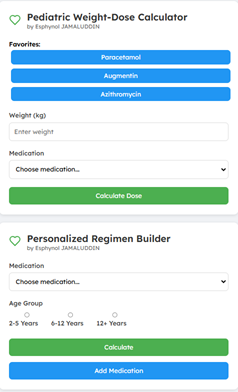

# Paediatric Rx Calculator

[](https://opensource.org/licenses/MIT)
[](https://github.com/yourusername/pediatric-calculators/pulls)

Two essential tools for pediatric medication management:

1. **Pediatric Weight-Dose Calculator** - Precise weight-based dosing for common medications
2. **Personalized Regimen Builder** - Custom treatment plan creator for complex cases

 <!-- Add a screenshot later -->

## Features

- 🍼 Weight-based dosage calculations (3-100kg range)
- 💊 15+ preloaded pediatric medications
- 📝 Custom regimen creation with local storage
- 🚨 Input validation and error handling
- 📱 Responsive mobile-friendly design

## Installation

```bash
git clone https://github.com/pinoipops/paeds-calculator.git
cd pediatric-calculators
